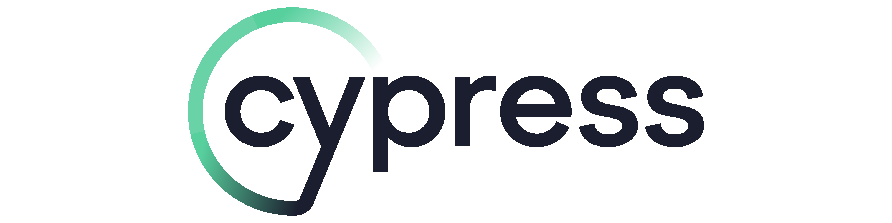

## [Cypress](https://www.cypress.io/)

Cypress is a frontend testing tool that automates the testing of web applications through a browser already installed on the host system. Cypress test specs are executed from a designated browser as asynchronous jquery commands, that control the selection and testing of elements on the page.

At StackHawk, we like Cypress, and we encourage its use for teams looking to establish E2E testing as a function of their engineering quality, or who may be newer to frontend QA or integration testing.

Follow the [Cypress guide for getting started](https://docs.cypress.io/guides/getting-started/installing-cypress).

### Testing with [javaspringvulny](https://github.com/kaakaww/javaspringvulny)

> Ensure javaspringvulny web application is running on `https://localhost:9000`

UI: `npx cypress open --config-file cypress/cypress.config.js`

Headed: `npx cypress run --config-file cypress/cypress.config.js --headed`

Headless: `npx cypress run --config-file cypress/cypress.config.js`

Specific test: `npx cypress run --config-file cypress/cypress.config.js -s path/to/spec.*.ts`

#### Parallel Browser Testing

Cypress supports [parallel browser testing](https://docs.cypress.io/guides/guides/parallelization#Turning-on-parallelization) as a paid feature used alongside the Cypress Dashboard.

### Adding Custom Authentication

Cypress allows for the creation of [custom commands](https://github.com/stackhawk/stackhawk-custom-image/blob/main/integrations/cypress/support/commands.ts). When using Cypress with typescript, custom commands require [type signatures](https://github.com/stackhawk/stackhawk-custom-image/blob/main/integrations/cypress/support/index.d.ts) to be updated.

### Scanning with HawkScan

To use Cypress custom scan discovery, you will need to specify the `NO_PROXY: "<-loopback>"` environment variable to scan localhost traffic. Otherwise Cypress will pick up and use the HTTP_PROXY variable auto-configured by HawkScan.

See the docs for using [Cypress tests with Custom Scan Discovery](https://docs.stackhawk.com/hawkscan/scan-discovery/custom.html).

You can use the sample [cypress-stackhawk.yml](./cypress/cypress-stackhawk.yml) file for an example of scanning a web application with it.

### Cypress Best Practices

* Cypress provides native support for typescript, which makes e2e testing and developing custom cypress commands much easier.

* Run your Cypress tests in the pipeline! Create a custom docker image with Cypress and HawkScan and everything your web application needs to run.

* [Official Docker Images](https://github.com/cypress-io/cypress-docker-images)

* https://docs.cypress.io/guides/references/best-practices